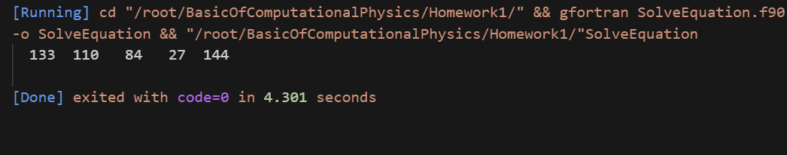

# T1 、在0到200内找方程的整数解

## 题目简介

在0到200之间找到方程的$a^5+b^5+c^5+d^5=e^5$的整数解。

## 程序描述

首先计算计算0-200的整数的五次方，将其存储在一个201维的数组result中，后面计算某个整数的5次方只需直接读取即可。

随后假设$e\geq a\geq b\geq c \geq d$以减少遍历所需次数，去掉重复解。

同时，若$e^5<a^5+b^5$便停止增加$b$，同理，若$e^5<a^5+b^5+c^5$便停止增大$c$，注意，对$d$不能这样，因为此时每次循环增加一次比较所消耗的时间明显大于节省遍历所节省的时间。

只要在遍历过程中得到$a^5+b^5+c^5+d^5=e^5$的解，就会将其输出出来。

## 伪代码

### Algorithm 1 SolveEquation

**input**：None

**output**: a,b,c,d,e : (int)

result = range(201)**5

existence = false

for e $\larr$1 to 200 do

​	for a $\larr$ 1 to e do

​		for b  $\larr$  1 to a do

​			if  result[a]+result[b] < result[e] then

​				for c  $\larr$  1 to b do

​					if result[a]+result[b]+result[c] <result[e] then

​						for d  $\larr$  1 to c do

​							if result[a]+result[b]+result[c]+result[d] == result[e]

​								existance = true

​								**return** a,b,c,d,e

​							end if

​						end for

​					end if

​				end for

​			end if

​	end for

end for 

if not existence 

**return** none

## 运行效果



# T2 24点

## 题目简介

从一副扑克中抽取4张牌，对4张牌使用加减乘除中的任何方法，使计算结果为24。例如，2,3,4,6通过(((4+6)-2)*3)=24，用程序找到算出24点的方法。

## 程序描述

四个数字排序有$4!=24$种情况；

有三个运算符号，对应加减乘除4种运算有$4^3=64$种情况；

不同的运算顺序（打括号的方法）有((AB)C)D、(A(BC))D、(AB)(CD)、A((BC)D)、A(B(CD))共五种运算，因此总共有$24\times64\times5=7680$种情况，只需找出其中等于24的情况即可。

在程序实现中，我们利用算法2计算出对4个数字的所有排列方式，再用算法3计算出对一种排列方式的所有计算方式可能得到的结果。最终只需要将二者结合起来即可得到计算24点的方式。

在算法3中，我们用1到4的数字分别对应加减乘除四种运算方式，

## 伪代码

### Algorithm 2 GetAllPermutations

**input**：a,b,c,d -》int

**out**：AllPermutations：matrix（int,shape=(24,3)）

 nums = [a,b,c,d]

count =1 

 for num1 $\larr$ a,b,c,d do

​	for num2 $\larr$ a,b,c,d do 

​		if num1  $\neq$ num2 then

​			for num3$\larr$ a,b,c,d do

​				$\cdots$

​					if num4 $\neq$ num1  and num4 $\neq$ num2 and num4 $\neq$ num3

​						AllPermutations[count,] $\larr$[num1,num2,num3,num4]

​						count +=1

​					end if

​			end for

​		end if

​	end for

end for

**return** AllPermutations

### Algorithm 3 GetAllResults

**input**: Permutation: Array（int,len=4）

**output** : AllResults：matrix(int,shape=(64,5)) 

A,B,C,D = Permutation

**function** Operator(OperatorNum->int,a->int,b->int):

if OperatorNum == 1 then

​	result$\larr$ a+b

end if

if OperatorNum == 2 then

​	result$\larr$ a-b

end if

if OperatorNum == 3 then

​	result$\larr$  a*b

end if

if OperatorNum == 4 then

​	result$\larr$  a/b

end if

return result

**end function** Operator

**function** ParenthesesPosition(Operatornums->Array(int,len=3),ParenthesesPositionNum->int, Permutation->):

if ParenthesesPositionNum==1 then 

​	result $\larr$ (A Operator1 B)Operator2 C)Operator3 D

end if

if ParenthesesPositionNum==2 then 

​	result $\larr$ (A Operator1 (B Operator2 C)Operator3 D

end if

if ParenthesesPositionNum==3 then 

​	result $\larr$ (A Operator1 B)Operator2 (C Operator3 D)

end if

if ParenthesesPositionNum==4 then 

​	result $\larr$ A Operator1 ((B Operator2 C) Operator3 D)

end if

if ParenthesesPositionNum==5 then 

​	result $\larr$ A Operator1 (B Operator2 (C Operator3 D)

end if

return result

**end function** ParenthesesPosition


count = 1

for i $\larr$ 1 to 4 do 

​	for j $\larr$ 1 to 4 do 

​		for k $\larr$ 1 to 4 do

​			for l $\larr$ 1 to 4 do

​				OperatorArray[count,:] = [i,j,k,l]

​				count += 1

​			end for

​		end for

​	end for

end for

AllResults[i,j] = ParenthesesPosition(OperatorArray[i,:],j)

**return** AllResults

## 运行效果

```
[Running] cd "/root/BasicOfComputationalPhysics/Homework1/" && gfortran Point24.f90 -o Point24 && "/root/BasicOfComputationalPhysics/Homework1/"Point24
The parenthesis position is((AB)C)D  
The selection of numbers and operation symbols is 4+ 6- 2* 3=24
The parenthesis position is(A(BC))D  
The selection of numbers and operation symbols is 4+ 6- 2* 3=24
The parenthesis position isA((BC)D)  
The selection of numbers and operation symbols is 4* 6/ 2+ 3=24
The parenthesis position is(A(BC))D  
The selection of numbers and operation symbols is 4+ 6* 3+ 2=24
The parenthesis position isA((BC)D)  
The selection of numbers and operation symbols is 4+ 6* 3+ 2=24
The parenthesis position is(A(BC))D  
The selection of numbers and operation symbols is 4* 6- 3* 2=24
The parenthesis position isA((BC)D)  
The selection of numbers and operation symbols is 4* 6- 3* 2=24
The parenthesis position isA(B(CD))  
The selection of numbers and operation symbols is 4* 6* 3- 2=24
The parenthesis position isA(B(CD))  
The selection of numbers and operation symbols is 4* 6/ 3- 2=24
The parenthesis position isA(B(CD))  
The selection of numbers and operation symbols is 4+ 2+ 6* 3=24
The parenthesis position is((AB)C)D  
The selection of numbers and operation symbols is 4- 2+ 6* 3=24
The parenthesis position is(A(BC))D  
The selection of numbers and operation symbols is 4- 2- 6* 3=24
The parenthesis position isA(B(CD))  
The selection of numbers and operation symbols is 4* 2* 6- 3=24
The parenthesis position is((AB)C)D  
The selection of numbers and operation symbols is 4/ 2+ 6* 3=24
The parenthesis position isA(B(CD))  
The selection of numbers and operation symbols is 4+ 2+ 3* 6=24
The parenthesis position is((AB)C)D  
The selection of numbers and operation symbols is 4+ 2* 3+ 6=24
The parenthesis position is(A(BC))D  
The selection of numbers and operation symbols is 4+ 3* 6+ 2=24
The parenthesis position isA((BC)D)  
The selection of numbers and operation symbols is 4+ 3* 6+ 2=24
The parenthesis position isA(B(CD))  
The selection of numbers and operation symbols is 4* 3+ 6/ 2=24
The parenthesis position is(A(BC))D  
The selection of numbers and operation symbols is 4* 3- 2* 6=24
The parenthesis position isA((BC)D)  
The selection of numbers and operation symbols is 4* 3- 2* 6=24
The parenthesis position is(A(BC))D  
The selection of numbers and operation symbols is 4/ 3- 2* 6=24
The parenthesis position isA((BC)D)  
The selection of numbers and operation symbols is 4/ 3- 2/ 6=24
The parenthesis position isA((BC)D)  
The selection of numbers and operation symbols is 6+ 4+ 2* 3=24
The parenthesis position is((AB)C)D  
The selection of numbers and operation symbols is 6+ 4- 2* 3=24
The parenthesis position is(A(BC))D  
The selection of numbers and operation symbols is 6+ 4- 2* 3=24
The parenthesis position is(A(BC))D  
The selection of numbers and operation symbols is 6+ 4/ 2* 3=24
The parenthesis position isA(B(CD))  
The selection of numbers and operation symbols is 6* 4* 3- 2=24
The parenthesis position isA(B(CD))  
The selection of numbers and operation symbols is 6* 4/ 3- 2=24
The parenthesis position isA((BC)D)  
The selection of numbers and operation symbols is 6+ 2+ 4* 3=24
The parenthesis position is((AB)C)D  
The selection of numbers and operation symbols is 6- 2+ 4* 3=24
The parenthesis position is(A(BC))D  
The selection of numbers and operation symbols is 6- 2- 4* 3=24
The parenthesis position is((AB)C)D  
The selection of numbers and operation symbols is 6* 2- 4* 3=24
The parenthesis position is((AB)C)D  
The selection of numbers and operation symbols is 6/ 2+ 3* 4=24
The parenthesis position isA(B(CD))  
The selection of numbers and operation symbols is 6+ 3* 4+ 2=24
The parenthesis position is(AB)(CD)  
The selection of numbers and operation symbols is 6- 3+ 4* 2=24
The parenthesis position is(AB)(CD)  
The selection of numbers and operation symbols is 6- 3- 4* 2=24
The parenthesis position is((AB)C)D  
The selection of numbers and operation symbols is 6- 3* 4* 2=24
The parenthesis position is(AB)(CD)  
The selection of numbers and operation symbols is 6- 3* 4* 2=24
The parenthesis position is(AB)(CD)  
The selection of numbers and operation symbols is 6- 3/ 4* 2=24
The parenthesis position is((AB)C)D  
The selection of numbers and operation symbols is 6* 3+ 4+ 2=24
The parenthesis position is(AB)(CD)  
The selection of numbers and operation symbols is 6* 3+ 4+ 2=24
The parenthesis position is(AB)(CD)  
The selection of numbers and operation symbols is 6* 3- 4+ 2=24
The parenthesis position is(AB)(CD)  
The selection of numbers and operation symbols is 6* 3* 4+ 2=24
The parenthesis position is(AB)(CD)  
The selection of numbers and operation symbols is 6* 3/ 4+ 2=24
The parenthesis position isA(B(CD))  
The selection of numbers and operation symbols is 6+ 3* 2+ 4=24
The parenthesis position is(AB)(CD)  
The selection of numbers and operation symbols is 6- 3+ 2* 4=24
The parenthesis position is(AB)(CD)  
The selection of numbers and operation symbols is 6- 3- 2* 4=24
The parenthesis position is((AB)C)D  
The selection of numbers and operation symbols is 6- 3* 2* 4=24
The parenthesis position is(AB)(CD)  
The selection of numbers and operation symbols is 6- 3* 2* 4=24
The parenthesis position is(AB)(CD)  
The selection of numbers and operation symbols is 6- 3/ 2* 4=24
The parenthesis position is((AB)C)D  
The selection of numbers and operation symbols is 6* 3+ 2+ 4=24
The parenthesis position is(AB)(CD)  
The selection of numbers and operation symbols is 6* 3+ 2+ 4=24
The parenthesis position is(AB)(CD)  
The selection of numbers and operation symbols is 6* 3- 2+ 4=24
The parenthesis position is(A(BC))D  
The selection of numbers and operation symbols is 6* 3- 2* 4=24
The parenthesis position isA((BC)D)  
The selection of numbers and operation symbols is 6* 3- 2* 4=24
The parenthesis position is(AB)(CD)  
The selection of numbers and operation symbols is 6* 3* 2+ 4=24
The parenthesis position is(AB)(CD)  
The selection of numbers and operation symbols is 6* 3/ 2+ 4=24
The parenthesis position is(A(BC))D  
The selection of numbers and operation symbols is 6/ 3- 2* 4=24
The parenthesis position isA((BC)D)  
The selection of numbers and operation symbols is 6/ 3- 2/ 4=24
The parenthesis position isA(B(CD))  
The selection of numbers and operation symbols is 2+ 4+ 6* 3=24
The parenthesis position isA(B(CD))  
The selection of numbers and operation symbols is 2* 4* 6- 3=24
The parenthesis position isA(B(CD))  
The selection of numbers and operation symbols is 2+ 4+ 3* 6=24
The parenthesis position is((AB)C)D  
The selection of numbers and operation symbols is 2+ 4* 3+ 6=24
The parenthesis position is((AB)C)D  
The selection of numbers and operation symbols is 2* 6- 4* 3=24
The parenthesis position is(A(BC))D  
The selection of numbers and operation symbols is 2+ 6* 3+ 4=24
The parenthesis position isA((BC)D)  
The selection of numbers and operation symbols is 2+ 6* 3+ 4=24
The parenthesis position is(A(BC))D  
The selection of numbers and operation symbols is 2* 6- 3* 4=24
The parenthesis position isA((BC)D)  
The selection of numbers and operation symbols is 2* 6- 3* 4=24
The parenthesis position is(A(BC))D  
The selection of numbers and operation symbols is 2+ 3* 6+ 4=24
The parenthesis position isA((BC)D)  
The selection of numbers and operation symbols is 2+ 3* 6+ 4=24
The parenthesis position isA((BC)D)  
The selection of numbers and operation symbols is 3* 4+ 6- 2=24
The parenthesis position isA(B(CD))  
The selection of numbers and operation symbols is 3* 4+ 6- 2=24
The parenthesis position is(A(BC))D  
The selection of numbers and operation symbols is 3* 4+ 2+ 6=24
The parenthesis position isA((BC)D)  
The selection of numbers and operation symbols is 3* 4- 2+ 6=24
The parenthesis position isA(B(CD))  
The selection of numbers and operation symbols is 3* 4- 2- 6=24
The parenthesis position isA((BC)D)  
The selection of numbers and operation symbols is 3* 4/ 2+ 6=24
The parenthesis position is((AB)C)D  
The selection of numbers and operation symbols is 3* 6+ 4+ 2=24
The parenthesis position is(AB)(CD)  
The selection of numbers and operation symbols is 3* 6+ 4+ 2=24
The parenthesis position isA((BC)D)  
The selection of numbers and operation symbols is 3* 6+ 4- 2=24
The parenthesis position isA(B(CD))  
The selection of numbers and operation symbols is 3* 6+ 4- 2=24
The parenthesis position isA(B(CD))  
The selection of numbers and operation symbols is 3* 6+ 4/ 2=24
The parenthesis position is(AB)(CD)  
The selection of numbers and operation symbols is 3* 6- 4+ 2=24
The parenthesis position is(AB)(CD)  
The selection of numbers and operation symbols is 3* 6* 4+ 2=24
The parenthesis position is(AB)(CD)  
The selection of numbers and operation symbols is 3* 6/ 4+ 2=24
The parenthesis position is(A(BC))D  
The selection of numbers and operation symbols is 3+ 6/ 2* 4=24
The parenthesis position is((AB)C)D  
The selection of numbers and operation symbols is 3* 6+ 2+ 4=24
The parenthesis position is(AB)(CD)  
The selection of numbers and operation symbols is 3* 6+ 2+ 4=24
The parenthesis position is(AB)(CD)  
The selection of numbers and operation symbols is 3* 6- 2+ 4=24
The parenthesis position isA((BC)D)  
The selection of numbers and operation symbols is 3* 6- 2+ 4=24
The parenthesis position isA(B(CD))  
The selection of numbers and operation symbols is 3* 6- 2- 4=24
The parenthesis position is(AB)(CD)  
The selection of numbers and operation symbols is 3* 6* 2+ 4=24
The parenthesis position isA((BC)D)  
The selection of numbers and operation symbols is 3* 6* 2- 4=24
The parenthesis position is(AB)(CD)  
The selection of numbers and operation symbols is 3* 6/ 2+ 4=24
The parenthesis position is(AB)(CD)  
The selection of numbers and operation symbols is 3- 2+ 4* 6=24
The parenthesis position is(AB)(CD)  
The selection of numbers and operation symbols is 3- 2- 4* 6=24
The parenthesis position is((AB)C)D  
The selection of numbers and operation symbols is 3- 2* 4* 6=24
The parenthesis position is(AB)(CD)  
The selection of numbers and operation symbols is 3- 2* 4* 6=24
The parenthesis position is(AB)(CD)  
The selection of numbers and operation symbols is 3- 2/ 4* 6=24
The parenthesis position is(A(BC))D  
The selection of numbers and operation symbols is 3* 2+ 4+ 6=24
The parenthesis position is(AB)(CD)  
The selection of numbers and operation symbols is 3- 2+ 6* 4=24
The parenthesis position is(AB)(CD)  
The selection of numbers and operation symbols is 3- 2- 6* 4=24
The parenthesis position is((AB)C)D  
The selection of numbers and operation symbols is 3- 2* 6* 4=24
The parenthesis position is(AB)(CD)  
The selection of numbers and operation symbols is 3- 2* 6* 4=24
The parenthesis position is(AB)(CD)  
The selection of numbers and operation symbols is 3- 2/ 6* 4=24
The parenthesis position isA((BC)D)  
The selection of numbers and operation symbols is 3* 2* 6- 4=24

[Done] exited with code=0 in 0.268 seconds
```

